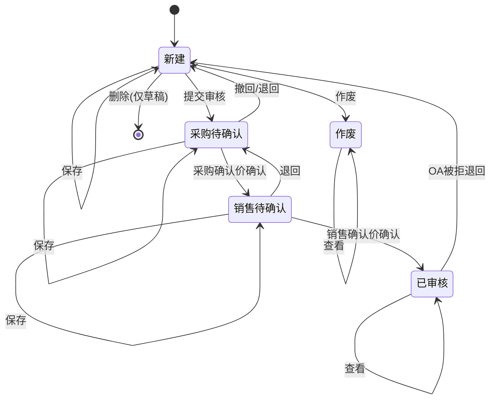
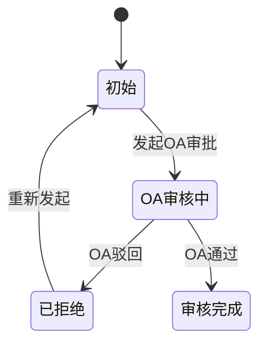

## 1. 文档信息

- **需求名称**：报价申请
- **所属模块**：销售管理 / 报价申请
- **覆盖范围**：报价申请 Web 列表、报价申请 Web 详情（新增 / 查看 / 编辑 / 作废 / 状态流转）、新建向导（PC）、手机端列表与详情（业务口径与 Web 对齐）；不含手机端独立 UI 改版
- **输入依据**：
  - `requirements/销售管理/报价申请/PRD-报价申请.md`（本文）
  - `requirements/销售管理/报价申请/PRD.报价申请列表.html`（Web 列表原型，v2.0.0）
  - `requirements/销售管理/报价申请/PRD.新增报价申请.html`（PC 新建向导原型，v2.0.0）
  - `requirements/销售管理/报价申请/PRD.报价申请.html`（Web 详情原型，v2.0.0）
  - `requirements/销售管理/报价申请/PRD.报价申请列表-手机端.html`（手机端列表原型，v2.0.0，规则 §8.7）
  - `requirements/销售管理/报价申请/PRD.报价申请-手机端.html`（手机端新建/详情原型，v2.0.0，规则 §8.8）
  - `requirements/销售管理/报价申请/PRD.报价申请-手机端-选择产品.html`（手机端选择产品子页，v2.0.0）
  - `requirements/基础信息/列表/产品分类毛利设置/US-产品分类毛利设置.md`
  - v2.0.0 已吸收之基线 US/UI 与各 `-modify` 批次（见 §1.1 变更记录；源稿已清理）
  - **当前分支独立批次（正文未并入 PRD，仅路径引用）**：
    - `requirements/销售管理/报价申请/报价申请-详细-二级分类及品牌应用/US-报价申请-二级分类及品牌应用-modify.md`（Web 详情）
    - `requirements/销售管理/报价申请/报价申请-详细-二级分类及品牌应用/UI-报价申请-二级分类及品牌应用-modify.html`
    - `requirements/销售管理/报价申请/新增报价申请/新增报价申请-详细-二级分类及品牌应用/US-新增报价申请-二级分类及品牌应用-modify.md`（Web 新增）
    - `requirements/销售管理/报价申请/新增报价申请/新增报价申请-详细-二级分类及品牌应用/UI-新增报价申请-二级分类及品牌应用-modify.html`
    - `requirements/销售管理/报价申请/报价申请手机端-详细-二级分类及品牌应用/US-报价申请手机端-二级分类及品牌应用-modify.md`（H5 手机端）
    - `requirements/销售管理/报价申请/报价申请手机端-详细-二级分类及品牌应用/UI-报价申请手机端-二级分类及品牌应用-modify.html`
    - 上游主数据：`requirements/基础资料/产品分类毛利设置/产品分类毛利设置-列表-二级分类与品牌维度/US-产品分类毛利设置-二级分类与品牌维度-modify.md`

### 1.1 文档版本与变更记录

- **当前版本**：2.1.0

| 版本 | 日期 | 变更摘要 | 来源 |
| --- | --- | --- | --- |
| （待合并）2.2.0 | 2026-06-07 | 二级分类及品牌应用：品类矩阵增加产品二级分类（只读）列；应用范围品牌摘要对齐主数据；明细毛利命中纳入标准品二级分类与标准品牌；Web 详情/新增/手机端三端同口径 | 独立 `-modify` 批次「二级分类及品牌应用」（见 §1 独立批次列表；**正文未并入**） |
| 2.1.0 | 2026-06-07 | 采购基准价匹配逻辑收口：四模式取数维度与匹配规则（市调单据类型、网站 LOV→SRM 映射、参考现客户价格、采购价格运营公司+当前有效最低）；客户/采购报价类型「获取周期性报价信息」；明细单位换算与前后端一致口径 | 采购基准价逻辑补充合并 |
| 2.0.0 | 2026-06-07 | 合并迭代：报价标题与渠道/客户/项目点多选级联；协作模式、是否益海、终端价、是否供货；五维毛利汇总；矩阵应用范围；明细导入/导出/修改导入导出；明细分页与作废；采购待确认增删产品；销售确认价锁定；经办人本人可改；列表职员客户数据权限；OA 增传与客户报价映射；临客标准名称可不填；手机端三批次口径对齐 | develop-20260603 合并 |
| 1.0.0 | 2026-03-21 | 初版：列表 + 详情一体方案；状态机、品类矩阵、明细算价、权限与 OA 联动 | 基线 US + 首版 PRD |

## 2. 问题陈述

当前报价申请流程缺少统一、标准化的系统承载，销售、运营、采购在报价申请的创建、查询、确认、审核与后续 OA 审批过程中，容易出现以下问题：

- 报价申请单查询入口分散，无法快速按客户、项目点、产品分类、状态等维度定位单据。
- 报价申请详情缺少统一的状态驱动编辑规则，不同角色在不同阶段的可操作内容不清晰。
- 采购基准价、销售参考价区间、确认销售毛利等关键价格口径缺少标准化算显传逻辑，线下沟通成本高，数据口径不一致。
- 产品分类毛利设置、标准产品匹配、OA 审批状态等上下游信息未在同一单据视图内闭环展示，导致协同效率低、追溯成本高。

本需求需要建设一套完整的报价申请产品方案，覆盖从列表查询、单据创建、价格确认到审核流转的全过程，并与权限体系、主数据体系、OA 状态展示保持一致。

## 3. 目标与成功指标

### 3.1 目标

- 为销售、运营、采购提供统一的报价申请入口，支持高频查询、新增、查看和流转操作。
- 将报价申请从"人工沟通驱动"转为"系统状态驱动"，明确不同阶段的字段可编辑范围与按钮权限。
- 建立报价申请中的核心价格口径，包括采购基准价、销售参考价区间、采购确认价、销售确认价、确认销售毛利。
- 打通报价申请与产品分类毛利设置、标准产品匹配、OA 审批状态展示之间的业务链路。

### 3.2 成功指标

- 报价申请单可通过列表页按运营公司、客户、项目点、报价类型、产品分类、状态、日期范围等关键条件组合查询。
- 用户可在单据不同状态下完成符合权限约束的保存、提交审核、采购确认、销售确认操作。
- 系统可基于经销商公司、客户类型、产品分类与采购基准价模式，正确展示或计算毛利区间、采购基准价、销售参考价区间、确认销售毛利。
- 列表页、详情页、导出内容、审计日志在字段口径上保持一致，减少重复解释和人工核对。

## 4. 用户与角色

### 4.1 核心用户

- **销售/运营**：创建报价申请、维护客户与申请信息、提交审核、销售确认价格。
- **采购**：在采购待确认阶段确认采购确认价与采购加价幅度。
- **管理者/审批相关角色**：查看报价申请状态与 OA 状态，跟踪业务进度。

### 4.2 权限模型

- 页面访问、按钮展示与操作可点击性均受角色权限控制。
- 列表与详情的数据可见范围受**运营公司**、**客户**、**职员**、**客户信息**四类数据权限取**交集**限制（在基线运营公司 ∩ 客户之上叠加职员与客户信息维度）。
- 采购待确认、销售待确认阶段的字段编辑与确认动作，除角色与状态外，须**当前登录职员 = 主表所选采购/销售人员**；不一致时相关字段只读、按钮禁用（Web 与手机端同一口径）。
- 权限判断必须同时覆盖：
  - 页面是否可进入
  - 字段是否可编辑
  - 按钮是否展示
  - 按钮是否可点击
  - 接口是否允许越权查询或提交

## 5. 用户故事

- 作为销售/运营，我希望在列表页通过客户、报价类型、单据状态、产品分类等条件快速定位报价单，以便跟进业务进度。
- 作为销售/运营，我希望可以新建报价申请并录入主表、品类矩阵与报价明细，以便发起后续价格确认流程。
- 作为采购，我希望在采购待确认阶段只修改采购相关价格字段，而不是误改单据基础信息，以便保证职责边界清晰。
- 作为销售/运营，我希望在销售待确认阶段确认销售价格，并看到系统自动计算出的确认销售毛利，以便快速判断报价是否合理。
- 作为业务人员，我希望在详情页直接看到 OA 单据状态，以便了解审批进展，无需额外切换系统。
- 作为管理者，我希望关键操作都有审计记录，以便追溯报价流转过程中的责任人与关键变更。

## 6. 范围定义

### 6.1 本期范围

- 报价申请 Web 列表页（含职员 + 客户信息数据权限）
- 报价申请 Web 详情页与 PC 新建向导
- 手机端列表/详情/新建（业务规则与 Web 对齐，布局沿用既有手机端规范）
- 新增、查看、编辑、作废四种详情使用场景
- 单据状态流转：新建、采购待确认、销售待确认、已审核、作废（终态）
- OA 单据状态展示与增传字段、审核完成后客户报价生成
- 报价标题、客户渠道/类型、客户与项目点多选级联
- 产品分类毛利命中、矩阵应用范围展示、采购基准价模式、价格联动计算、标准产品匹配
- 明细：协作模式、是否益海、终端价、是否供货、明细分页、导入/导出/修改导入导出
- 五维毛利汇总、销售确认价锁定、经办人本人可改
- 权限控制、数据权限、导出审计、关键操作审计

### 6.2 不在本期范围

- OA 审批流程本身的设计与实现，仅承载 OA 状态展示、增传与下游客户报价联动
- 产品分类毛利设置主数据维护功能
- 标准产品匹配算法服务的独立治理平台
- 价格趋势的正式算法与外部行情接入
- 列表页独立"导出明细"按钮形态；本期仅保留统一导出入口
- 反审核（作废已纳入本期；OA 驳回退回新建沿用基线）
- 临客询价无标准品时一级分类/矩阵/基准价链路的进一步放宽（待业务确认）

## 7. 业务流程

### 7.1 单据状态流转

### 7.2 OA 状态流转

### 7.3 关键流程说明

1. 用户进入报价申请列表，按条件查询目标单据或点击新增进入详情页。
2. 销售/运营在新建状态维护主表信息、选择报价品类、补充报价明细并保存。新建状态下的草稿单据支持**删除**。
3. 用户提交审核后，单据进入采购待确认，基础信息与品类矩阵只读，仅允许采购侧维护采购相关字段。销售在采购确认前可执行**撤回**，采购若发现信息有误可**退回**至新建状态。
4. 采购确认后，单据进入销售待确认，仅允许销售侧维护销售确认价等字段。销售若不认可采购确认价，可将单据**退回**至采购待确认。
5. 销售确认后，单据进入已审核，单据只读，并可进入 OA 相关后续状态。
6. 若 OA 审批被**拒绝/驳回**，除了 OA 状态变更为"已拒绝"外，该报价申请单据的主状态将**自动退回至"新建"状态**，允许销售重新编辑并再次提交。

## 8. 产品方案

### 8.1 列表页

#### 8.1.1 页面目标

为用户提供统一的报价申请检索、入口跳转和批量操作载体，支撑高频查询、导出与进入详情。进入方式：销售管理 > 报价申请 > 报价申请列表。

#### 8.1.2 查询条件

查询区位于列表上方，布局与交互以 HTML 原型为准（对齐 DMS 列表页筛选区规范：默认 7 项 + 按钮组，支持"更多 / 收起"）。

**默认展示的 7 个条件**（其余收纳在"更多"展开后）：

| 条件 | 输入方式 | 匹配规则 | 候选/枚举 |
| --- | --- | --- | --- |
| 运营公司 | 下拉单选 | 精确 | 候选按运营公司数据权限过滤 |
| 客户名称 | 文本输入 | 名称模糊匹配（包含） | 候选受客户数据权限约束；实现阶段可升级为联想下拉 |
| 报价类型 | 下拉单选 | 精确 | 常规报价、临采报价、临客询价 |
| 项目点名称 | 文本输入 | 关键字模糊匹配（包含） | — |
| 客户类型 | 下拉单选 | 精确 | 酒店、团餐、社餐 |
| 单据状态 | 下拉单选 | 精确 | 新建、采购待确认、销售待确认、已审核 |
| OA 单据状态 | 下拉单选 | 精确 | 初始、OA审核中、已拒绝、审核完成 |

**展开后额外展示的条件**：

| 条件 | 输入方式 | 匹配规则 | 候选/枚举 |
| --- | --- | --- | --- |
| 产品分类 | 多选下拉（勾选） | 单据关联的产品分类集合与所选集合存在交集 | 候选项为系统维护的产品一级分类 |
| 采购人员 | 下拉单选 | 精确（按姓名） | 候选按组织/角色及数据权限过滤 |
| 销售人员 | 下拉单选 | 精确（按姓名） | 同上 |
| 开始时间 | 日期范围（起—止） | 开始时间在所选范围内 | `YYYY-MM-DD` |
| 结束时间 | 日期范围（起—止） | 结束时间在所选范围内 | `YYYY-MM-DD` |

按钮：**查询**（主按钮）、**重置**（次按钮）、**更多 / 收起**（文字按钮，切换展开区域）。

规则要求：

- 下拉候选必须受权限范围过滤；运营公司变化后，客户名称候选按运营公司范围联动刷新。
- 产品分类未选任何项表示不按该维度过滤；已选时按交集命中。
- 默认时间范围：原型不预填日期；系统实现时可配置默认近 30 天。
- 点击查询后，分页重置为第 1 页。
- 点击重置后，清空所有查询条件；若后续需要恢复默认时间范围，作为实现参数配置。

#### 8.1.3 列表展示

列表列集合与列顺序以 HTML 原型为准，字段规格如下：

| 字段 | 含义 | 格式/对齐 | 排序 |
| --- | --- | --- | --- |
| （勾选） | 行多选，表头支持全选/半选 | 居中 | 否 |
| 序号 | 当前页行号 | 数字/居中 | 否 |
| 申请单号 | 报价申请单唯一编号；可点击进详情 | 链接样式/左对齐 | 支持（可选） |
| 报价标题 | 单据标题摘要 | 文本/左对齐；超长省略+tooltip | 支持（可选） |
| 单据状态 | 业务流转状态 | 文本着色/左对齐 | 支持（可选） |
| OA 单据状态 | OA 审批流状态 | 文本着色/左对齐 | 支持（可选） |
| 运营公司 | 报价单所属运营公司 | 文本/左对齐 | 支持（可选） |
| 报价类型 | 常规报价/临采报价/临客询价 | 文本/左对齐 | 支持（可选） |
| 产品分类 | 本单涉及的产品一级分类；多值以顿号分隔 | 文本/左对齐；超长省略+tooltip | 支持（可选） |
| 客户名称 | 报价客户名称 | 文本/左对齐 | 支持（可选） |
| 项目点名称 | 报价关联项目点名称；非临客多选时以顿号「、」拼接展示 | 文本/左对齐；超长省略+tooltip | 支持（可选） |
| 客户类型 | 酒店/团餐/社餐 | 文本/左对齐 | 支持（可选） |
| 采购人员 | 负责采购确认的人员（姓名） | 文本/左对齐 | 支持（可选） |
| 销售人员 | 负责销售确认的人员（姓名） | 文本/左对齐 | 支持（可选） |
| 开始时间 | 报价有效期开始 | 日期 `YYYY-MM-DD`/左对齐 | 支持 |
| 结束时间 | 报价有效期结束 | 日期 `YYYY-MM-DD`/左对齐 | 支持 |
| 申请理由 | 报价申请原因说明 | 左对齐；省略号+tooltip | 否 |
| 备注 | 备注信息 | 左对齐；省略号+tooltip | 否 |
| 操作 | 查看（进入详情） | 链接/居中 | 否 |

工具条区域：左侧为 **新增 / 导入 / 导出**；右侧展示 **已选 X 条**、**共 X 条**。

页面规则：

- 分页：默认每页 20 条；支持切换 10 / 20 / 50 条/页，展示"第 x 页 / 共 y 页，共 z 条"；上一页/下一页在首页/末页/无数据时禁用。
- 列宽与超长处理：申请理由、备注、项目点名称等长文本列支持省略号+tooltip。
- 空值展示 `-`。
- 无数据时展示空态文案：「暂无数据，请调整查询条件后重试」。

#### 8.1.4 工具条操作

- **新增**：进入详情页新增模式；保存成功后返回列表或进入新单据详情，以实现与产品约定为准。
- **导入**：保留入口，导入模板与细则由独立需求承接。
- **导出**：列表页本期仅保留一个导出入口；导出当前查询结果，包含列表主表字段及报价明细字段，并写入导出审计记录，不单独提供"导出明细"按钮。

#### 8.1.5 列表交互边界

- 默认排序建议按开始时间倒序；如存在统一排序规范，以统一规范为准。
- 从列表进入详情后返回列表，系统应保留原查询条件、分页位置与展开/收起状态。
- 无权限访问列表页时，展示「暂无权限访问该页面，请联系管理员开通权限」，不返回空白页。
- 查询无结果时，展示空态文案「暂无数据，请调整查询条件后重试」，并保留当前筛选条件供用户继续调整。
- 查询、导出按钮需具备防重复点击能力，避免重复请求或重复导出。

### 8.2 详情页

#### 8.2.1 页面结构

详情页由以下区域组成：

- 标题区：返回、单据 ID、**报价标题**、单据状态、OA 单据状态
- 基本信息区（含客户渠道/类型、客户与项目点多选级联）
- 品类与采购基准价模式区（含**应用范围**列）
- 报价明细区（含明细分页、一级分类筛选、五维毛利汇总）
- 制单信息区（创建人/创建时间/更新人/更新时间，只读系统字段）
- 底部按钮区（含**作废**，仅新建态展示）

#### 8.2.2 页面模式

- **新增模式**：URL 不带 `id`，展示空表单，销售人员默认当前登录人；列表「新增」进入 **`PRD.新增报价申请.html`** 两步向导，保存后跳转 **`PRD.报价申请.html`** 并携带 `seedKey` 等参数。
- **编辑模式**：URL 带 `id` 且状态允许编辑，加载已有单据并按状态控制字段可编辑范围。
- **查看模式**：任意有查看权限角色可进入，只读查看单据。

#### 8.2.3 基本信息

| 字段 | 必填 | 新建可编辑 | 非新建可编辑 | 输入方式 | 取值/联动规则 |
| --- | --- | --- | --- | --- | --- |
| 报价标题 | 是 | 是 | 否（只读） | 文本 | ≤200 字；默认 `{客户名称}{开始时间 yyyy-MM-dd}{结束时间 yyyy-MM-dd}销售报价`；用户手工修改后不再被联动覆盖 |
| 运营公司 | 是 | 是 | 否（只读） | 下拉单选 | 候选按运营公司数据权限过滤 |
| 经销商公司 | 是 | 是 | 否（只读） | 下拉单选 | 先选运营公司后系统自动带出候选列表；切换运营公司时清空并重选；用于与产品分类毛利设置按经销商公司+客户类型匹配 |
| 报价类型 | 是 | 是 | 否（只读） | 下拉枚举 | 常规报价、临采报价、临客询价 |
| 客户渠道 | 是（非临客） | 是 | 否（只读） | 下拉枚举 | 团餐及大众餐饮、酒店及高端餐饮；临客询价同必选；变更清空下级客户类型/客户/项目点 |
| 客户类型 | 是 | 是 | 否（只读） | 下拉枚举 | 酒店、团餐、社餐；随客户渠道级联；变更时与经销商公司共同决定品类矩阵毛利命中并刷新 |
| 客户名称 | 是 | 是 | 否（只读） | 多选下拉/手输 | **非临客/临采/常规**：多选，可搜索，存储 ID 数组；**临客询价**：手工输入；候选按客户数据权限 + 渠道/类型过滤 |
| 项目点名称 | 否 | 是 | 否（只读） | 多选下拉/手输 | **非临客**：多选，候选项受已选客户约束；**临客询价**：手工输入；上级客户变更清空下级 |
| 采购人员 | 是 | 是 | 否（只读） | 下拉选择 | 候选为系统内采购角色人员，可按运营公司、数据权限过滤 |
| 销售人员 | 是 | 是 | 否（只读） | 下拉选择 | 同上（销售侧角色）；新建时默认选中当前登录用户，允许改选；编辑已有单据时展示单据已存值，不随打开重算 |
| 开始时间 | 是 | 是 | 否（只读） | 日期选择 | 日期（`YYYY-MM-DD`），不承载时分秒 |
| 结束时间 | 是 | 是 | 否（只读） | 日期选择 | 日期（`YYYY-MM-DD`）；结束时间 ≥ 开始时间 |
| 申请理由 | 是 | 是 | 否（只读） | 长文本 | 支持省略号+tooltip |
| 备注 | 否 | 是 | 是（除已审核/作废） | 长文本 | 各状态均可编辑，已审核/作废状态只读 |
| 单据状态 | — | 否（只读） | 否（只读） | 系统字段 | 系统按钮驱动 |
| OA 单据状态 | — | 否（只读） | 否（只读） | 系统字段 | OA 接口回写 |

**PC 新建向导**：两步向导与详情页上述主表/明细逻辑对齐；第一步维护报价标题与渠道/类型/客户/项目点；第二步维护协作模式、是否益海、五维毛利汇总等；保存进入详情时携带多选种子数据。

### 8.3 品类与采购基准价模式

#### 8.3.1 业务目标

通过报价品类选择，将主数据中的产品分类毛利规则映射到当前单据，并驱动明细价格相关字段的算显传。

#### 8.3.2 品类矩阵字段规格

| 呈现列 | 含义 | 新建 | 提交后 | 必填 | 规则 |
| --- | --- | --- | --- | --- | --- |
| 报价品类（一级分类） | 用户勾选的品类 | 可勾选/取消 | 只读 | 至少勾选一项 | 勾选驱动矩阵行；取消勾选移除对应行 |
| 应用范围 | 毛利规则应用范围展示 | 只读 | 只读 | — | 与「产品分类毛利设置」口径一致；每品类一行；无配置展示「—」；不改变明细命中逻辑 |
| 采购基准价模式 | 本单品类取价口径 | 每行下拉单选 | 只读 | 每行须为合法枚举 | 枚举见 §9.4.1 |
| 最低毛利率(%) | 主数据命中展示 | 只读 | 只读 | — | 来自命中规则；无命中展示「—」 |
| 最高毛利率(%) | 主数据命中展示 | 只读 | 只读 | — | 来自命中规则；无命中展示「—」 |
| 参考信息 | 参考客户/网站（条件展示） | 条件必选 | 只读 | 模式为参考现客户/网站时必选 | 见下方说明 |

#### 8.3.3 呈现与规则

- 毛利规则来源于基础信息模块"产品分类毛利设置"，该模块按**经销商公司 + 产品一级分类 + 客户类型**维护毛利率区间；报价申请侧仅引用其生效结果，不在单据内维护主数据。
- 最低/最高毛利率根据**经销商公司 + 客户类型 + 产品一级分类**命中产品分类毛利设置主数据；无命中时展示为「—」，不阻断勾选品类。
- 采购基准价模式为必填单选，共四种可选值：

| 采购基准价模式 | 数据来源 | 取价维度 | 说明 |
| --- | --- | --- | --- |
| 市调价格 | SRM 市调数据 | 经销商公司 + 标准产品 | 按单据类型筛选后取最近一条有效市调单价；细则见 §9.4.3 |
| 网站价格 | SRM 报价系统 | 经销商公司 + 标准产品 + 参考网站 | 网站 LOV 与 SRM 价格表映射后，当前有效范围内取最近一条；细则见 §9.4.3 |
| 采购价格 | 本系统采购类报价 | 运营公司 + 标准产品 | 当前有效采购类报价中取单价最低的一条；细则见 §9.4.3 |
| 参考现客户价格 | 本系统历史客户报价 | 标准产品 + 参考客户 | 取该客户维度下最近一条有效单价；细则见 §9.4.3 |

- 本期"采购基准价模式"统一采用上表枚举名称与取价维度，不再沿用原型中的倍率换算或「采购价格(有效且最低)」等旧命名口径。
- 各模式匹配主维度、过滤条件、「最近一次」判定、单位换算等完整规则以 **§9.4.3** 为唯一口径。
- 市调价格、网站价格从 SRM 取数；采购价格、参考现客户价格从本系统取数；若对应数据源未返回价格，采购基准价显示为空。
- 参考现客户价格模式不调用 SRM；若无历史报价数据，采购基准价显示为空。
- **参考信息**：模式为"参考现客户价格"时必须选择**参考客户**；模式为"网站价格"时必须选择**参考网站**；其它模式参考信息展示为 `-`。
- 参考信息在单据保存时需同时保存**来源类型、关联 ID、展示名称快照**，避免上游主数据变更导致历史单据无法还原。
- 保存与提交审核前，至少勾选一个报价品类。
- 提交审核时，所有已勾选报价品类必须命中有效毛利规则；若存在未命中规则的品类，允许保存草稿，但不允许提交审核，并明确提示未命中品类。
- **经销商公司/客户类型变更联动**：变更时系统自动重新匹配毛利规则，刷新矩阵中最低/最高毛利率，并同步更新明细中继承的毛利区间与采购基准价模式。

#### 8.3.4 批量能力

- 支持批量设置采购基准价模式（弹窗单选后覆盖品类矩阵全部已勾选品类行）。
- 批量设置后，需同步刷新明细中的采购基准价模式、毛利区间、采购基准价与销售参考价区间。

### 8.4 报价明细

#### 8.4.1 加行方式

支持以下明细来源与工具：

- 从产品库选择（按已选报价品类过滤标准品弹窗）
- 获取参考客户产品（须已选客户）
- **导入产品**（模板见 §8.4.6）
- **明细修改导出** / **明细修改导入**（见 §8.4.6）
- **批量修改协作模式**（仅新建、须勾选行）
- **一级分类筛选**（仅影响展示/合计/表头全选，不删数据）
- 删除已勾选明细行
- **调整标准产品匹配**弹窗（新建 + 采购待确认可用）

明细分页：明细表下方标准分页（10/20/50）；序号为**全局行号**；导出/导入/修改导入导出均为**全量明细**，不受分页影响。

#### 8.4.2 明细字段规格

| 字段 | 含义 | 新建 | 采购待确认 | 销售待确认 | 已审核 | 规则 |
| --- | --- | --- | --- | --- | --- | --- |
| 客户产品名称 | 客户侧名称 | 可编辑 | 只读 | 只读 | 只读 | 文本；导入/参考客户/产品库可预填 |
| 品牌 | 客户侧品牌 | 可编辑 | 只读 | 只读 | 只读 | 文本 |
| 规格 | 客户侧规格 | 可编辑 | 只读 | 只读 | 只读 | 文本 |
| 标准产品名称 | 标准品名称 | 只读 | 只读 | 只读 | 只读 | 产品库/匹配弹窗/导入逻辑带出 |
| 标准产品代码 | 标准品编码 | 只读 | 只读 | 只读 | 只读 | 同上 |
| 标准品牌 | 标准品牌 | 只读 | 只读 | 只读 | 只读 | 同上 |
| 标准规格 | 标准规格 | 只读 | 只读 | 只读 | 只读 | 同上 |
| 匹配相似度 | 综合相似推荐 | 只读+新建可调 | 只读 | 只读 | 只读 | 展示 Top1 推荐与综合分；新建可打开调整匹配弹窗 |
| 一级分类 | 产品一级分类 | 只读 | 只读 | 只读 | 只读 | 随标准品带出；驱动矩阵命中 |
| 协作模式 | 配送协作方式 | 可编辑 | 只读 | 只读 | 只读 | 枚举：`大仓配送` / `供应商直送`；导入可回写 |
| 是否益海 | 是否益海产品 | 只读 | 只读 | 只读 | 只读 | 随标准品主数据带出 |
| 单位 | 计量单位 | 可选 | 只读 | 只读 | 只读 | 随产品字段默认外包装单位；下拉可修改 |
| 采购基准价模式 | 取价口径 | 只读（可批量改） | 只读 | 只读 | 只读 | 由品类矩阵同步；明细批量弹窗可覆写 |
| 市调价格 | 市调单价 | 只读 | 只读 | 只读 | 只读 | 接口回填 |
| 采购基准价 | 取价结果 | 只读 | 只读 | 只读 | 只读 | 由后端按模式从对应数据源直接获取 |
| 毛利区间 | 规则区间展示 | 只读 | 只读 | 只读 | 只读 | 命中矩阵规则 `{min}%-{max}%` |
| 销售参考价区间 | 参考区间 | 只读 | 只读 | 只读 | 只读 | 采购基准价×(1+毛利上下限) |
| 销量预估 | 预估销量 | 可编辑 | 只读 | 只读 | 只读 | 数值；手工输入，单位与行单位一致 |
| 采购加价幅度 | 加价金额 | 只读 | **可编辑** | 只读 | 只读 | 采购待确认阶段可手动修改并参与双向联动计算采购确认价 |
| 上次销售价 | 历史销售单价 | 只读 | 只读 | 只读 | 只读 | 系统回填 |
| 采购确认价 | 采购侧确认价 | 只读 | **可编辑** | 只读 | 只读 | 原型=基准价+加价幅度；采购待确认阶段与加价幅度双向联动 |
| 销售确认价 | 销售侧确认价 | **只读** | 只读 | **可编辑** | 只读 | 仅销售待确认阶段可编辑；**锁定规则**：已有值且 ≠0 时，采购侧变更仅重算确认销售毛利，不改写销售确认价 |
| 终端价 | 终端销售价 | 可编辑 | 只读 | 只读 | 只读 | 位于销售确认价之后；明细修改导入可回写（新建态） |
| 确认销售毛利 | 毛利率 | 只读 | 只读 | 只读 | 只读 | (销售确认价−采购确认价)/销售确认价 |
| 是否供货 | 是否实际供货 | 可编辑 | 只读 | 只读 | 只读 | 是/否，默认「是」；见 §8.6.5 |
| 价格趋势 | 涨跌提示 | 只读 | 只读 | 只读 | 只读 | 原型占位 |

#### 8.4.3 明细联动逻辑

- 一级分类由标准产品带出。
- 明细行根据一级分类匹配品类矩阵中的第一条对应行，继承毛利区间与采购基准价模式。
- 采购基准价为只读字段，系统根据明细行命中的采购基准价模式，按 **§9.4.3** 匹配规则从对应数据源获取并**换算为明细行单位下的单价**后回填：
  - **市调价格**：SRM 市调数据，维度为经销商公司 + 标准产品，按单据类型筛选后取最近一条。
  - **网站价格**：SRM 网站类型报价，在经销商公司 + 标准产品基础上叠加矩阵所选参考网站（LOV→SRM 映射），当前有效范围内取最近一条。
  - **采购价格**：本系统采购类报价，维度为运营公司 + 标准产品，在当前有效集合中取单价最低的一条。
  - **参考现客户价格**：本系统历史客户报价，维度为参考客户 + 标准产品，取最近一条有效单价。
  - 若对应数据源未返回价格、或缺少单位换算关系，采购基准价显示为空，不阻断保存，但需在提交审核时校验提示。
- 本期采购基准价取值以接口返回结果为准（优先返回已按明细单位换算后的单价），不采用原型中的前端倍率换算逻辑；前后端展示与计算须与明细行单位一致，见 §9.4.3.4。
- 销售参考价区间为只读字段，根据采购基准价与毛利上下限计算。
- 采购确认价与采购加价幅度在采购待确认阶段支持双向联动（最后一次人工输入方向决定联动方向）。
- 采购确认价需在用户执行"采购确认价确认"后才正式生效；生效后的采购确认价作为后续销售确认、确认销售毛利计算及审计留痕的依据。
- 销售确认价仅在**销售待确认**阶段可编辑；新建、采购待确认、已审核阶段均为只读。
- 确认销售毛利为只读字段，由销售确认价与采购确认价计算得出。

#### 8.4.4 标准产品匹配

- 系统根据客户产品名称、品牌、规格与标准品主数据进行相似度计算（Dice 二元组加权）。
- 相似度综合得分规则为：名称 40% + 品牌 35% + 规格 25%，取综合分最高的 5 条候选。
- 明细行匹配相似度列固定展示综合分最高的推荐标准品名称、综合分及分项得分。
- 当用户已在弹窗中选定其它标准品时，标准产品名称列为当前选用值，匹配相似度列仍展示算法 Top1 推荐。
- 新建阶段支持打开"调整标准产品匹配"弹窗，在 Top5 候选中按综合分降序单选并回写标准品及一级分类等，闭环联动毛利/采购基准价等。

#### 8.4.5 明细边界规则

- 新建状态下允许删除明细行；删除后需同步刷新已选条数、序号及相关汇总展示。
- 当客户未选择时，不允许执行"获取参考客户产品"，并给出明确提示。
- 当导入文件格式错误、缺少必填列或解析失败时，需返回失败原因；本次文件整体导入失败，不允许部分成功部分失败混合落库。
- 当标准产品无可匹配候选时，系统应展示"未匹配到标准产品"，允许用户后续手动调整或暂存草稿；**临客询价**类型保存/提交时**不要求**标准产品名称必填或完成匹配；常规报价、临采报价仍须强校验匹配。
- 提交审核时，若明细行（非临客）仍未匹配标准产品或无法确定一级分类，系统需强阻断并提示具体明细行。
- 当品类矩阵变更导致明细行命中的毛利规则或采购基准价模式变化时，系统需重新计算相关只读字段，并提示用户关键字段已被刷新。
- "批量基准价模式"能力按现有原型逻辑完整上线，包含矩阵区和明细区的批量设置与联动刷新能力。

#### 8.4.6 明细导入 / 导出

**导入产品模板**（「导入产品」，10 列顺序）：

客户产品名称、品牌、规格 → 标准产品代码、标准产品名称、标准单位 → 预估销量 → 销售单价、终端价、协作模式

- 有标准产品代码且主数据存在 → **直配**，不走相似度匹配
- 新增列均选填；协作模式仅 `大仓配送` / `供应商直送`

**明细修改导出 / 明细修改导入**：

- **明细修改导出**：UTF-8 CSV（BOM），列与明细表全列一致（不含勾选列）；已审核仅可导出
- **明细修改导入**：按 **序号 + 标准产品代码** 匹配行；主要回写 **采购确认价、销售确认价、终端价**（按状态/字段权限）；回写后重跑是否供货等校验
- 导出/导入均为**全量明细**，不受分页影响

#### 8.4.7 五维毛利汇总

明细表下方展示只读 **五维毛利汇总**（益海/非益海 × 直送/大仓 + 整单）；有销量预估时按「确认价 × 销量预估」加权；已审核/作废仍展示只读。

### 8.5 状态驱动的可编辑规则

#### 8.5.1 字段可编辑范围

| 单据状态 | 基本信息 | 品类矩阵 | 报价明细 | 备注 | 可执行动作 |
| --- | --- | --- | --- | --- | --- |
| 新建 | 可编辑 | 可编辑 | 可编辑（销售确认价、确认销售毛利只读） | 可编辑 | 保存、提交审核、删除、**作废** |
| 采购待确认 | 只读 | 只读 | 采购确认价、采购加价幅度可编辑（**仅采购本人**）；**增删产品、调整匹配** | 可编辑 | 保存、采购确认价确认、撤回、退回 |
| 销售待确认 | 只读 | 只读 | 仅销售确认价可编辑（**仅销售本人**） | 可编辑 | 保存、销售确认价确认、退回 |
| 已审核 | 只读 | 只读 | 只读 | 只读 | 查看；明细修改仅导出 |
| 作废 | 只读 | 只读 | 只读 | 只读 | 查看 |

#### 8.5.2 角色 × 按钮操作

| 角色 | 操作按钮 | 是否展示 | 可点击条件 | 前置校验 | 状态变化 |
| --- | --- | --- | --- | --- | --- |
| 销售/运营 | 保存 | 有权限则展示 | 新建/采购待确认/销售待确认 且编辑/新增 | 必填校验 | 保存数据，不改变状态 |
| 销售/运营 | 提交审核 | 有权限则展示 | 新建 且编辑/新增 | 主表必填、品类矩阵校验通过、明细至少 1 行 | 新建→采购待确认 |
| 销售/运营 | 删除 | 有权限则展示 | 新建（仅草稿） | 二次确认 | 删除单据 |
| 销售/运营 | 作废 | 有权限则展示 | **仅新建** | 二次确认 | 新建→**作废**（终态） |
| 销售/运营 | 撤回 | 有权限则展示 | 采购待确认 | — | 采购待确认→新建 |
| 采购 | 退回 | 有权限则展示 | 采购待确认 | — | 采购待确认→新建 |
| 采购 | 采购确认价确认 | 有权限则展示 | 采购待确认 且编辑 且**采购本人** | 明细行采购确认价校验（见 §8.6.3/§8.6.5） | 采购待确认→销售待确认 |
| 销售/运营 | 退回 | 有权限则展示 | 销售待确认 | — | 销售待确认→采购待确认 |
| 销售/运营 | 销售确认价确认 | 有权限则展示 | 销售待确认 且编辑 且**销售本人** | 明细行销售确认价校验（见 §8.6.4/§8.6.5） | 销售待确认→已审核 |
| 任意有权限角色 | 查看 | 有权限则展示 | 任意状态 | — | 进入查看模式 |

### 8.6 校验规则汇总

#### 8.6.1 保存校验（各状态通用）

- 主表必填字段校验（除项目点名称、备注外）。
- 结束时间不得早于开始时间。
- 品类矩阵：至少勾选一个报价品类；每个已勾选品类的采购基准价模式须为合法枚举；参考现客户价格/网站价格模式对应的参考信息必选。
- 金额字段精度与非负校验。

#### 8.6.2 提交审核校验（新建→采购待确认）

- 包含保存校验全部项。
- 明细至少 1 行。
- 所有已勾选报价品类必须命中有效毛利规则；未命中的品类需明确提示。
- 明细行必须匹配标准产品并确定一级分类；未匹配行需强阻断并提示具体行。
- 存在采购基准价为空的明细行时，强阻断并提示。
- 同一经销商公司下若存在重复毛利配置，阻止提交并提示。

#### 8.6.3 采购确认价确认校验（采购待确认→销售待确认）

- 所有明细行采购确认价必填、格式合法（数值、≥0、保留 2 位小数）；结合是否供货规则见 §8.6.5。
- 须为**采购本人**方可执行。

#### 8.6.4 销售确认价确认校验（销售待确认→已审核）

- 所有明细行销售确认价必填；结合是否供货规则见 §8.6.5。

#### 8.6.5 是否供货与确认价校验

- **是否供货 = 是**（默认）：采购确认价、销售确认价须 **> 0**。
- **是否供货 = 否**：采购确认价、销售确认价 **允许 = 0**。
- 「否」改回「是」且价仍为 0 时，保存/确认动作拦截并提示。
- 已审核/作废只读；明细修改导入回写后须重跑本规则。

#### 8.6.6 提交审核补充（非临客）

- 须已选客户渠道、客户类型；报价标题必填。
- 非临客须至少选择一个客户；项目点可选多选。

### 8.7 手机端列表页

#### 8.7.1 页面目标

为移动端用户提供报价申请检索与入口跳转能力；**业务口径与 §8.1 完全一致**（含职员 + 客户信息数据权限交集），仅布局与交互遵循益分销企微版 H5 规范。原型见 `PRD.报价申请列表-手机端.html`。

#### 8.7.2 查询与筛选

- 顶栏搜索：单号、**报价标题**、客户名称、项目点名称、运营公司、申请理由关键字模糊包含。
- 筛选抽屉条件集合与 §8.1.2 对齐（运营公司、客户名称、报价类型、项目点、客户类型、单据状态、OA 单据状态；展开含产品分类多选、采购/销售人员、开始/结束时间范围）。
- 数据权限、候选过滤、重置与查询行为同 §8.1.2 / §8.1.5。

#### 8.7.3 列表展示

- 卡片式列表，字段含：申请单号（可进详情）、单据状态、OA 单据状态、**报价标题**、运营公司、报价类型、产品分类、客户名称、项目点、客户类型、采购/销售人员、有效期、申请理由、备注。
- 支持下拉加载更多（默认每批 20 条）；无数据空态与 §8.1.3 口径一致。
- **新增**入口进入 `PRD.报价申请-手机端.html`（无 `id`）；**查看**带 `id` 进入同一详情原型。

### 8.8 手机端详情 / 新建

#### 8.8.1 页面模式

- **新增**（无 `id`）与**详情/编辑**（有 `id`）**共用一套页面**与原型 `PRD.报价申请-手机端.html`；两步向导：① 基础信息 ② 品类与明细。
- 字段可编辑范围、状态驱动按钮、经办人本人约束、校验规则分别引用 **§8.5、§8.6**；与 Web 差异仅为终端布局与控件形态。

#### 8.8.2 主表与品类

- 主表含报价标题、客户渠道/类型、客户与项目点多选级联、临客询价手工录入等，口径同 §8.2.3。
- 品类矩阵按品类展示**应用范围（只读）**与采购基准价模式、毛利区间；应用范围主数据与 `PRD.报价申请.html` / `PRD.新增报价申请.html` **同源**（经销商公司 + 客户类型 + 一级分类；同一品类多条时分行，并补「—」对照行）。

#### 8.8.3 明细与汇总

- 明细含协作模式、是否益海、终端价、是否供货、采购/销售确认价等，规则同 §8.4。
- 明细区下方展示五维毛利汇总（益海/非益海 × 直送/大仓 + 整单），口径同 §8.4.7。
- 手机端三批次能力（标题/项目点/确认价毛利、是否供货确认价可为 0、经办人本人可改）均已收敛至本原型，与 Web 同一业务口径。

## 9. 关键业务规则与数据口径

### 9.1 单据与 OA 状态规则

- 单据状态流转严格按照状态机执行，不允许跳步。
- OA 单据状态与报价申请单据状态独立维护。
- 仅当报价申请单据状态达到**已审核**后，才允许发起 OA 申请；在此之前 OA 单据状态固定为"初始"。
- 销售确认完成后，系统自动触发 OA 申请，无需用户手工再次发起；若自动触发失败，需记录失败日志并进入补偿或重试流程。
- **OA 驳回/拒绝联动**：当 OA 审批被拒绝后，该报价申请单据的状态将自动退回为**"新建"**，此时 OA 单据状态仍保留为"已拒绝"；销售可在此基础上重新修改并再次提交审核，重新提交后 OA 状态重置为"初始"。
- 本期不允许出现 `单据状态=已审核` 且 `OA 单据状态=已拒绝` 的稳定组合；OA 驳回后必须回退到"新建"。

#### 9.1.1 主状态 × OA 状态合法组合表

| 单据状态 | 合法 OA 单据状态 | 说明 |
| --- | --- | --- |
| 新建 | 初始、已拒绝 | 初始表示尚未发起 OA；已拒绝表示 OA 驳回后退回编辑 |
| 采购待确认 | 初始 | 尚未进入 OA |
| 销售待确认 | 初始 | 尚未进入 OA |
| 已审核 | 初始、OA审核中、审核完成 | 已审核后方可发起 OA；若 OA 驳回则主状态回退，不保留"已审核+已拒绝" |
| 作废 | 初始 | 终态；不参与 OA |

### 9.2 单号规则

- 报价申请单号建议采用 `BF + YYYYMMDD + 4位流水号` 规则（示例：`BF202603180001`）。流水号按自然日递增，日内从 `0001` 开始。
- 如系统已有统一单号中心，则以统一单号中心实现为准。

### 9.3 产品分类毛利引用规则

- 报价申请侧只引用"产品分类毛利设置"的规则结果，不承接该主数据的新增、编辑、删除、导入等维护能力；若规则缺失或配置错误，应返回上游主数据维护入口或提示用户联系维护人处理。
- 毛利规则命中粒度为**经销商公司 + 单一产品一级分类 + 单一客户类型**。即使上游页面支持多选分类、多选客户类型维护，报价申请侧在命中时仍按展开后的单一组合匹配。
- 同一经销商公司下，同一"单一产品一级分类 + 单一客户类型"组合理论上只能命中一条有效毛利规则；若接口返回多条命中结果，视为上游主数据异常，允许草稿保存但必须阻止提交审核，并提示存在重复毛利配置。
- 毛利区间展示口径沿用上游配置，详情页矩阵区与明细区展示最低毛利率、最高毛利率时使用百分比口径；用于价格计算时按数值换算为对应比率。
- 单据保存时，除保存命中规则 ID 外，还需保存命中时的最低毛利率、最高毛利率等关键字段快照，确保历史单据不受上游配置后续变更影响。

### 9.4 价格计算规则

#### 9.4.1 采购基准价模式字典（唯一口径）

| 采购基准价模式 | 数据来源 | 查询维度 | 参考信息要求 | 说明 |
| --- | --- | --- | --- | --- |
| 市调价格 | SRM 市调数据 | 经销商公司 + 标准产品 | 无 | 按单据类型筛选市调记录后取最近一条；见 §9.4.3.2 |
| 网站价格 | SRM 报价系统 | 经销商公司 + 标准产品 | 必填：参考网站 | 网站 LOV 映射 SRM 后，当前有效范围内取最近一条；见 §9.4.3.2 |
| 采购价格 | 本系统采购类报价 | 运营公司 + 标准产品 | 无 | 当前有效采购类报价中取单价最低的一条；见 §9.4.3.2 |
| 参考现客户价格 | 本系统历史客户报价 | 标准产品 + 参考客户 | 必填：参考客户 | 取该客户维度下最近一条有效单价；见 §9.4.3.2 |

- 本期采购基准价模式、命名、取价维度统一以本节为准，不再使用原型中的「采购价格(有效且最低)」「参考采购价格」等旧枚举口径。
- 采购基准价统一由后端按模式匹配取数，换算为明细行单位后回填；不采用前端倍率换算逻辑。完整匹配规则见 **§9.4.3**。

#### 9.4.2 价格计算规则

- **采购基准价**：只读字段，根据明细行所属品类对应的采购基准价模式，按 **§9.4.3** 从不同数据源匹配取数，**换算为明细行单位下的单价**后写入：

| 采购基准价模式 | 数据来源 | 查询维度 | 取值规则（摘要） |
| --- | --- | --- | --- |
| 市调价格 | SRM 市调数据 | 经销商公司 + 标准产品 | 符合类型与生效条件的记录中，按时间序取最近一条单价 |
| 网站价格 | SRM 报价系统 | 经销商公司 + 标准产品 + 参考网站 | 当前有效范围内按时间序取最近一条网站单价 |
| 采购价格 | 本系统采购类报价 | 运营公司 + 标准产品 | 当前有效集合中取单价最低的一条；并列最低以实现约定决胜 |
| 参考现客户价格 | 本系统历史客户报价 | 标准产品 + 参考客户 | 取最近一条有效单价 |

  - 若对应数据源未返回价格、或无法完成单位换算，采购基准价显示为空。
  - 品类矩阵中采购基准价模式变更时，需重新获取明细行的采购基准价并刷新下游计算字段。
- **销售参考价区间**：`采购基准价 × (1 + 毛利下限)` 至 `采购基准价 × (1 + 毛利上限)`；当采购基准价为空时，销售参考价区间同样显示为空。
- **采购确认价**：原型口径为 `采购基准价 + 采购加价幅度`，并在采购待确认阶段支持手工修正与双向联动；仅在执行"采购确认价确认"动作后正式生效。
- 采购待确认阶段点击"保存"仅保存采购确认价草稿值；仅在执行"采购确认价确认"动作后，采购确认价才作为后续销售确认与确认销售毛利计算的正式依据。
- **销售确认价**：仅在**销售待确认**阶段允许编辑，其它状态只读。
- **确认销售毛利**：`(销售确认价 - 采购确认价) / 销售确认价`。
  - 当"销售确认价"为空或为 0 时，为避免除零错误，确认销售毛利直接兜底展示为 `0%`（或 `-`）。
  - 在**销售待确认**环节，执行"销售确认价确认"动作时，"销售确认价"为**必填项（不可为空且必须大于0）**。
- **金额精度与进位**：所有金额/价格类字段（如市调价格、采购基准价、销售参考价、采购确认价、销售确认价等）计算与展示时统一**保留 2 位小数**，尾数按**四舍五入**规则处理；百分比/比率类字段展示到小数点后 2 位。
- **销量预估**：由用户手工输入，单位与当前明细行"单位"字段保持一致。

#### 9.4.3 采购基准价匹配规则（取数）

适用于报价申请**明细行**在选定采购基准价模式后，自动回填**采购基准价**（及市调价格等关联只读展示字段）时的匹配、换算与空值处理。本节在 §9.4.1 字典基础上，约定「最近一次」判定、主数据映射与单位一致要求。

##### 9.4.3.1 模式与匹配规则总览

| 采购基准价模式 | 匹配主维度 | 辅助/过滤条件 | 取数规则（业务口径） |
| --- | --- | --- | --- |
| 市调价格 | 报价单 **经销商公司** + 明细 **标准产品** | **单据类型**（基础数据区分，数据来源于 SRM 市调）+ 市调/试点类业务标签 | 在符合类型与生效条件的 SRM 市调数据中，按业务时间/生效时间取 **最近一条** 单价 |
| 网站价格 | 报价单 **经销商公司** + 明细 **标准产品** | 矩阵行所选 **网站信息**（LOV 表，与 SRM 价格表网站维度 **已建立对应**） | 取该产品在该经销商公司、且网站维度与 LOV→SRM 映射一致下，**当前有效**范围内按时间序 **最近一条** 网站单价 |
| 参考现客户价格 | 明细 **标准产品** | 矩阵行 **参考客户** + **客户报价类型**（含「获取周期性报价信息」等；是否参与筛选以业务/接口约定为准） | 取该产品在该参考客户维度下，本系统历史报价中 **最近一条** 有效单价 |
| 采购价格 | 报价单 **运营公司** + 明细 **标准产品** | 仅统计 **当前有效** 的采购类报价（有效期、状态等以主数据/接口为准）+ **采购报价类型**（含「获取周期性报价信息」等；是否参与筛选以业务/接口约定为准） | 在 **全部当前有效** 报价中，取 **单价最低** 的一条；若并列最低，以实现约定决胜规则（如取最新一条） |

> 若界面文案与字典存在「参考现客户价格 / 参考客户价格」等差异，以 **§9.4.1** 枚举名为准。

##### 9.4.3.2 各模式说明

**市调价格**

1. 使用报价申请主表 **经销商公司** 作为组织维度。
2. 使用明细行 **标准产品**（或与 SRM/市调系统对齐的产品标识）作为产品维度。
3. **单据类型**：基础数据对单据/价格记录做类型区分；市调类取数来源于 **SRM 市调数据**。匹配时须按主数据或接口约定的类型维度筛选市调相关记录。
4. 在符合 **类型 + 有效期/生效期** 的记录中，按约定时间序（如报价日期、生效起始日）取 **最近一条**，其单价作为取价结果（「市调价格」展示字段与「采购基准价」关系以实现与本 PRD 一致）。

**网站价格**

1. 在市调价格相同维度（**经销商公司** + **标准产品**）基础上，增加矩阵行 **参考网站** 作为过滤条件。
2. **网站信息主数据**：单独维护 **LOV 表**；LOV 与 SRM 价格表中区分网站来源的字段 **建立一一或一对多映射**，保证选中网站编码能正确传入 SRM 查询条件。
3. 从网站类型报价中，在 **当前有效** 范围内按时间序取 **最近一条** 单价。

**参考现客户价格**

1. 使用矩阵行 **参考客户** 作为客户维度。
2. 使用明细行 **标准产品** 作为产品维度。
3. 在本系统 **历史客户报价** 数据源中，取该客户 + 该产品 **最近一次** 有效价格；若无记录则采购基准价为空。
4. **客户报价类型**：客户报价主数据增加类型 **「获取周期性报价信息」**。匹配时除客户、产品、有效期/状态外，须按业务与接口约定是否按类型过滤；未单独约定时与「不限类型」的既有行为兼容。

**采购价格**

1. 使用报价申请主表 **运营公司** 作为组织维度（与「经销商公司」区分：采购侧报价挂在运营公司或对应采购组织下，以实现主数据为准）。
2. 使用明细行 **标准产品** 作为产品维度。
3. 先圈定 **当前有效** 的采购类报价：查询时点满足有效期、状态可用等条件，即「当前有效」与「全部可参与比价的报价」为同一集合口径。
4. 在该集合中取 **单价最低** 的一条；若无当前有效记录则为空。并列最低价以实现约定决胜规则（如取生效起始最近一条）。
5. **采购报价类型**：采购报价主数据同样增加类型 **「获取周期性报价信息」**。若业务要求比价范围仅含或优先周期性报价来源，须在查询中增加类型维度；未启用时默认集合口径与上线前评审结论一致。

##### 9.4.3.3 客户报价 / 采购报价类型「获取周期性报价信息」

在 **客户报价**、**采购报价** 各自（或统一主数据下分域）的 **类型/单据类型** 枚举中，新增取值 **「获取周期性报价信息」**，用于标识与周期性报价信息采集、归档、匹配相关的报价记录。

凡从本系统历史 **客户报价**、**采购类报价** 取数的模式（参考现客户价格、采购价格等），在业务要求需按周期性报价口径筛选或优先时，须将该类型字段纳入查询条件，与主数据编码、接口字段名及落表约定对齐。若某场景不要求区分周期性与其他来源，以实现与业务确认的默认筛选口径为准（不限类型 / 仅含 / 排除 / 优先等，须在接口说明中写死）。

##### 9.4.3.4 报价产品单位与价格单位转换

**原则**

- 外部系统或历史单据中的价格往往带有 **计价单位**（如「元/吨」「元/箱」）；报价申请明细行有 **业务单位**（与标准产品、包装规格相关）。
- 匹配到价格记录后，须将价格 **统一换算为报价申请明细行当前单位下的单价**，再写入采购基准价及市调单价等展示字段。
- **前端与后端一致**：展示取价结果、联动计算（销售参考价区间、毛利相关展示）时，均须 **按报价申请明细行单位** 理解与换算；换算系数应与主数据/后端规则 **同源**（接口返回已换算单价，或返回来源价+来源单位+系数由前后端共用同一套换算服务/字典）。

**实现要点**

| 要点 | 说明 |
| --- | --- |
| 单位来源 | 明确价格来源记录上的计价单位与明细行单位的来源（主数据换算关系、包装规格换算系数） |
| 换算路径 | 优先使用标准产品主数据中维护的单位换算关系；若无直接关系，经基本单位中转 |
| 后端 | 落库、接口、导出、提交校验等权威口径以明细单位下的单价为准 |
| 前端 | 列表/详情/试算等交互数值统一按明细单位展示与参与公式；若展示来源单位须标注且不与未换算数值混用于计算 |
| 精度 | 换算后金额按 §9.4.2 保留 2 位小数与四舍五入 |
| 无法换算 | 缺少换算关系或来源单位冲突时，采购基准价置空；提交审核时按既有规则阻断或提示 |
| 审计 | 可选记录来源单价、来源单位、换算系数，便于核对（是否落库以实现为准） |

**与「最近一次」的关系**：时间序比较须在 **同一业务含义的单价** 上进行——多条记录单位不同时，应先换算到统一比较单位后再比较时间，或先按时间取最近一条再换算到明细单位；两种方式须择一并在实现中统一，避免混用。

##### 9.4.3.5 接口设计待细化项

以下在接口与主数据落表阶段细化，不阻断 PRD 评审：

- 市调相关单据类型在基础数据与 SRM 中的枚举值、字段名对照表。
- 客户报价 / 采购报价侧类型「获取周期性报价信息」的编码、名称、所属域及与各取数接口请求参数的映射；各模式下默认是否按该类型过滤的最终业务口径表。
- 网站 LOV 编码与 SRM 价格表字段取值的映射清单（含一对多若有）。
- 「当前有效」的精确判定（时区、边界日、状态码列表）。
- 并列最低价时的决胜规则（若业务要求唯一命中一条）。
- 前后端换算系数下发方式：优先约定「接口统一返回明细单位单价」或「统一下发换算元数据」二选一，避免双端各算导致尾差。

### 9.5 权限与审计规则

- 列表访问、查看、编辑、新增、导入、导出、状态推进等操作必须校验角色权限。
- 查询接口、详情接口与候选项接口必须遵守运营公司、客户、职员、客户信息数据权限交集。
- 采购/销售确认环节须校验**经办人本人**（Web 与手机端一致）。
- 本期列表页仅提供一个"导出"按钮，不单独提供"导出明细"按钮；导出文件需同时包含列表主表字段与报价明细字段。
- 导出必须记录导出人、导出时间、查询条件快照、导出条数。
- 保存、提交审核、采购确认、销售确认等关键操作需记录审计日志（操作人、时间、单据 ID、前后状态、关键字段变更摘要）。

### 9.6 异常、幂等与传输规则

- 保存、提交审核、采购确认、销售确认、导出等关键按钮需支持前后端双重防重，避免用户连续点击造成重复提交。
- 当保存或状态推进过程中发生网络中断、接口超时或服务异常时，系统应明确提示"本次操作未确认成功，请刷新后重试"，并避免前端误展示为已成功。
- 状态推进接口需按当前单据最新状态校验幂等性；若单据已被他人推进到下一状态，应返回明确提示并刷新页面数据。
- OA 状态回写失败时，不应影响报价申请主流程已完成的业务状态，但必须记录失败日志并支持后续补偿或重试。
- 产品分类毛利、标准产品等外部依赖数据获取失败时，应至少区分"无数据""重复配置""接口失败"三类提示，避免用户误判为业务不存在。
- **市调价格 / 网站价格**模式：SRM 调用失败或未返回价格时，将该明细行采购基准价置空（不阻断草稿保存）；提交审核时若存在采购基准价为空的明细，强阻断并提示。
- **采购价格 / 参考现客户价格**模式：本系统取数失败、无匹配记录或单位无法换算时，同样置空并按上述提交审核规则处理。
- 单位换算失败时须与「无价格」区分提示（若接口可区分），避免用户误判为数据源无报价。
- 导出采用异步任务时，需定义任务状态、失败重试与导出记录可追溯规则；若采用同步导出，需定义超时提示文案。

### 9.7 OA 增传与客户报价联动

#### 9.7.1 发起 OA 增传字段

除基线主表/明细外，发起 OA 时须增传：

- **主表**：报价标题、项目点（非临客多值拼接）、客户渠道
- **明细行**：协作模式、是否益海
- **汇总**：五维毛利率（数值保留 2 位小数，不带 `%` 符号）

#### 9.7.2 OA 审核完成 → 客户报价

- 生成/更新 **1 条**客户报价（不按项目点拆单）
- 报价单名称 ← 报价标题；项目点列表、起始日期；状态按日期判生效/待生效
- 明细协作模式映射：`大仓配送` → `仅供货、代分拣`；`供应商直送` → `代配送`
- 终端价、采购价逐行写入（空则留空，不以其它价替代）

#### 9.7.3 OA 已拒绝

- 单据主状态回退「新建」；不处理客户报价；OA 状态保留「已拒绝」

## 10. 实施决策

### 10.1 产品结构决策

- 报价申请采用"列表页 + 详情页"的标准 DMS Web 结构。
- 详情页统一承载新增、查看、编辑场景，通过 URL 参数与单据状态区分模式。

### 10.2 主数据依赖决策

- 产品分类毛利设置不在报价申请单内维护，只引用其规则结果；上游主数据仍由基础信息模块独立维护。
- 单据需同时存储命中规则的**规则 ID**与**字段快照**，用于关联追溯与历史还原，避免主数据变化直接影响历史单据展示。
- 参考信息需同时存储**来源类型、关联 ID、展示名称快照**，保证历史单据可还原。

### 10.3 计算与展示决策

- 价格相关字段遵循"计算字段只读、输入字段有限可改"的原则，降低手工误操作概率。
- 列表页、详情页、导出内容需保持字段口径一致，避免前后展示不一致。
- 采购基准价按后端接口匹配取数并换算为明细单位，不沿用原型中的前端倍率换算逻辑；四模式规则见 §9.4.3。
- 标准产品匹配算法本期先保持现有逻辑上线，不额外调整权重、候选范围与推荐规则。

### 10.4 技术实现决策

- 页面交互以现有 HTML 原型为准。
- 列表筛选区遵循现有 DMS Web 列表页规范。
- 状态、权限、校验、计算逻辑应由后端与前端共同兜底，避免仅依赖前端控制。
- 明细批量基准价模式相关弹窗与联动逻辑按现有原型完整上线，不做裁剪。

## 11. 验收标准

### 11.1 功能验收

- 用户可进入报价申请列表并完成查询、重置、新增、查看、导出；列表数据权限含职员与客户信息维度。
- 新建报价申请时，主表（含报价标题、渠道/客户/项目点）、品类矩阵、明细数据可正确保存。
- PC 新建向导与详情页逻辑一致；手机端业务口径与 Web 对齐。
- 不同单据状态下，字段可编辑范围、经办人本人约束与按钮动作符合权限和状态规则。
- 协作模式、是否益海、终端价、是否供货、五维毛利汇总、矩阵应用范围按规则展示与计算。
- 明细导入/导出、明细修改导入导出、明细分页（导出全量）行为正确。
- 新建态可作废进入终态；采购待确认可增删产品与调整匹配并记操作日志。
- 临客询价保存/提交时不要求标准产品名称必填；常规/临采仍强校验。
- 销售确认价锁定：已有非零销售确认价时采购侧变更不重写销售确认价。
- 采购基准价、销售参考价区间、确认销售毛利等关键字段可按规则展示或计算；四模式采购基准价匹配与单位换算符合 §9.4.3。
- OA 单据状态在详情页和列表页均可正确展示。
- 销售确认完成后，系统自动发起 OA 申请，增传字段完整；审核完成后正确生成客户报价映射。
- OA 审批被拒绝后，单据主状态自动退回"新建"，OA 单据状态保留"已拒绝"；用户修改并重新提交后，OA 单据状态重置为"初始"。
- 单据保存时可保留草稿；提交审核时若存在未命中有效毛利规则的报价品类，系统必须阻止提交并给出提示。

### 11.2 异常与边界验收

- 无数据权限用户无法查看越权数据。
- 未填写必填字段、时间范围非法、品类矩阵不合法时，系统给出明确错误提示并阻止提交。
- 明细为空、未匹配标准产品或无法确定一级分类、价格关键字段缺失、状态不允许时，不允许推进到下一状态。
- 无匹配主数据时，系统行为明确且可解释，不应出现静默错误。
- 重复点击提交、保存、确认按钮时，不会生成重复数据或重复流转。
- 并发场景下，如他人已更新同一单据，当前用户再次提交时可收到状态冲突提示。
- 外部依赖接口失败时，页面给出可执行的错误提示，不出现前端静默失败。

## 12. 测试策略

- **权限测试**：验证按钮权限、页面权限、数据权限交集过滤。
- **状态测试**：覆盖新建、采购待确认、销售待确认、已审核四种状态下的字段编辑与按钮行为，并覆盖 OA 驳回后回退新建、重新提交的状态组合。
- **计算测试**：覆盖采购基准价模式、毛利区间、销售参考价区间、采购确认价、确认销售毛利等核心公式。
- **采购基准价匹配测试**：覆盖四模式取数（市调单据类型、网站 LOV 映射、参考现客户最近一条、采购价格运营公司+最低有效）、单位换算与无法换算置空、获取周期性报价信息类型筛选、并列最低价决胜。
- **上游规则引用测试**：覆盖产品分类毛利设置的单条命中、未命中、重复命中、接口失败四类场景。
- **联动测试**：覆盖运营公司、经销商公司、客户类型、报价品类、明细一级分类之间的联动。
- **导出与审计测试**：验证统一导出按钮的字段完整性（含主表与明细）、导出日志与关键操作日志落库。
- **SRM 集成测试**：覆盖市调价格、网站价格模式 SRM 取数的正常响应、无价格返回、LOV 映射缺失、接口超时与调用失败场景，并验证保存和提交审核时的校验阻断逻辑。
- **本系统取价测试**：覆盖采购价格（运营公司+最低有效）、参考现客户价格（最近一条）及获取周期性报价信息类型筛选。
- **兼容性测试**：验证 Web 端页面在标准浏览器下的布局、空态、分页、tooltip 与弹窗交互。

## 13. 风险与确认口径

### 13.1 已确认口径

- 提交审核时，报价品类必须命中有效毛利规则；无规则仅允许保存，不允许提交。
- 产品分类毛利规则在单据侧同时保存规则 ID 与字段快照。
- OA 单据状态与报价申请单据状态独立；仅在单据已审核后允许发起 OA 申请。
- 销售确认完成后自动触发 OA 申请。
- OA 驳回后，单据主状态自动退回"新建"，不保留"已审核 + 已拒绝"的稳定组合。
- 采购确认价在采购确认后正式生效，并作为后续计算依据。
- 销售确认价仅在"销售待确认"阶段可编辑。
- 开始时间、结束时间字段统一为日期（`YYYY-MM-DD`）。
- 列表页本期仅保留一个导出入口，不单独提供"导出明细"按钮。
- 采购基准价模式字典、命名与取价维度以 §9.4.1 为唯一口径；匹配与单位换算以 §9.4.3 为唯一口径。
- 市调价格按单据类型 + 经销商公司 + 标准产品在 SRM 市调数据中取最近一条。
- 网站价格经 LOV→SRM 映射后，在当前有效范围内取最近一条。
- 采购价格按运营公司 + 标准产品，在当前有效采购类报价中取单价最低的一条。
- 参考现客户价格从本系统历史客户报价取最近一条，不调用 SRM。
- 客户报价、采购报价类型新增「获取周期性报价信息」；取数时按业务约定纳入类型筛选。
- 前后端采购基准价展示与计算均按明细行单位，与后端落库口径一致。
- 明细批量基准价模式相关现有逻辑完整上线。
- 销量预估由用户手工录入，单位与行单位一致。
- 标准产品匹配算法本期保持现有逻辑。
- 确认销售毛利公式为 `(销售确认价 − 采购确认价) / 销售确认价`。
- 是否供货=否 时确认价可为 0；=是 时须 >0。
- 作废为新建态专属终态动作；明细修改导出/导入全量不受分页影响。
- 手机端三批次（标题/是否供货/经办人本人）与 Web 同一业务口径。

### 13.2 残余风险

- 自动触发 OA 申请后的失败补偿、重试次数与人工介入机制仍需在接口设计阶段明确。
- 同时保存规则 ID 与字段快照后，需在接口与数据库设计中统一字段口径，避免出现"规则变更后展示字段与快照不一致"的实现偏差。
- 采购确认价"正式生效"与"草稿保存值"的前后端展示文案仍需在交互稿中进一步细化，避免用户误解已锁价。
- **待确认**：职员/客户信息权限档案粒度、管理员豁免；临客无标准品时一级分类/矩阵链；是否供货在列表导出/OA 展示；采购待确认是否可改「是否供货」。
- 采购基准价各模式下「获取周期性报价信息」类型默认筛选口径（不限/仅含/排除/优先）须在接口设计阶段与业务最终确认（见 §9.4.3.5）。
- 网站 LOV 与 SRM 映射、市调单据类型枚举、并列最低价决胜规则等待接口落表细化（见 §9.4.3.5）。

## 14. 里程碑建议

1. 完成 PRD 评审并确认待定口径。
2. 输出接口清单、字段字典与状态机说明。
3. 完成前后端开发与联调。
4. 完成权限、计算、导出与审计专项测试。
5. 完成上线验收与培训。
